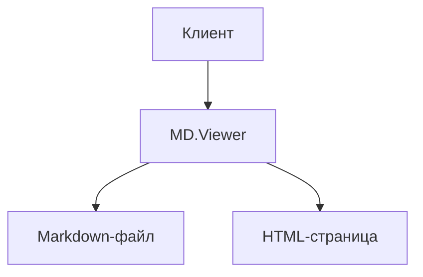

# MD.Viewer

> Безопасный самохостируемый PHP-просмотрщик Markdown-файлов с автоматическим содержанием, нумерацией заголовков, сносками, диаграммами Mermaid, кнопками копирования кода, тёмной темой и файловым браузером.

[](https://github.com/paulmann/MD.Viewer/blob/main/LICENSE)
[](https://php.net)
[](https://github.com/paulmann/MD.Viewer/releases)

---

## Содержание

- [1. Быстрый старт](#1-быстрый-старт)
- [2. Описание и назначение](#2-описание-и-назначение)
- [3. Требования](#3-требования)
- [4. Установка](#4-установка)
- [5. Структура файлов](#5-структура-файлов)
- [6. Использование](#6-использование)
  - [6.1 Режим просмотрщика](#61-режим-просмотрщика)
  - [6.2 Режим файлового браузера](#62-режим-файлового-браузера)
  - [6.3 URL-параметры](#63-url-параметры)
- [7. Возможности](#7-возможности)
  - [7.1 Автоматическое содержание](#71-автоматическое-содержание)
  - [7.2 Нумерация заголовков](#72-нумерация-заголовков)
  - [7.3 Диаграммы Mermaid](#73-диаграммы-mermaid)
  - [7.4 Блоки кода с копированием](#74-блоки-кода-с-копированием)
  - [7.5 Таблицы](#75-таблицы)
  - [7.6 Сноски и ссылки-источники](#76-сноски-и-ссылки-источники)
  - [7.7 Задачи (task lists)](#77-задачи-task-lists)
  - [7.8 Эмодзи](#78-эмодзи)
  - [7.9 Изображения](#79-изображения)
  - [7.10 Тёмная тема](#710-тёмная-тема)
  - [7.11 Адаптивная ширина контента](#711-адаптивная-ширина-контента)
  - [7.12 Универсальные паттерны](#712-универсальные-паттерны)
- [8. Настройка констант](#8-настройка-констант)
  - [8.1 Функциональные переключатели](#81-функциональные-переключатели)
  - [8.2 Лимиты безопасности](#82-лимиты-безопасности)
  - [8.3 Стиль переносов строк](#83-стиль-переносов-строк)
- [9. Безопасность](#9-безопасность)
- [10. Синтаксис Markdown](#10-синтаксис-markdown)
  - [10.1 Заголовки](#101-заголовки)
  - [10.2 Форматирование текста](#102-форматирование-текста)
  - [10.3 Ссылки и изображения](#103-ссылки-и-изображения)
  - [10.4 Списки](#104-списки)
  - [10.5 Цитаты](#105-цитаты)
  - [10.6 Горизонтальные разделители](#106-горизонтальные-разделители)
  - [10.7 Ссылки-сноски на источники](#107-ссылки-сноски-на-источники)
  - [10.8 Сноски (footnotes)](#108-сноски-footnotes)
  - [10.9 Reference links](#109-reference-links)
- [11. Файловый браузер](#11-файловый-браузер)
- [12. Именование файлов по имени скрипта](#12-именование-файлов-по-имени-скрипта)
- [13. Тонкие случаи и решение проблем](#13-тонкие-случаи-и-решение-проблем)
- [14. Changelog](#14-changelog)
- [15. Лицензия](#15-лицензия)

---

## 1. Быстрый старт

```bash
# 1. Клонируйте репозиторий в директорию веб-сервера
git clone https://github.com/paulmann/MD.Viewer.git /var/www/html/docs

# 2. Создайте Markdown-файл рядом со скриптом
cp /var/www/html/docs/index.md.example /var/www/html/docs/index.md

# 3. Откройте в браузере
# https://your-domain.com/docs/
```

> **Минимальный вариант:** положите `index.php` и `index.md` в одну директорию, откройте `index.php` в браузере — MD.Viewer автоматически найдёт и отобразит `index.md`.

---

## 2. Описание и назначение

### 2.1 Проблематика

Стандартный способ хранить техническую документацию — Markdown-файлы в репозитории. Однако их сырой вид неудобен для конечных пользователей: нет навигации, нет нумерации, нет красивого форматирования. Существующие решения либо требуют сложной инфраструктуры (Node.js, генераторы статических сайтов), либо зависят от внешних SaaS-платформ.

**MD.Viewer решает эту задачу радикально просто:** один PHP-файл превращает любой Markdown-файл в профессиональную HTML-страницу без зависимостей, без базы данных и без сборочного процесса.

### 2.2 Для кого подходит

- Разработчики, публикующие техническую документацию на собственном сервере
- Команды, использующие внутренние вики на базе Markdown
- DevOps-инженеры, которым нужен быстрый просмотр README и runbook'ов
- Авторы технических статей и инструкций
- Все, кто хочет красиво отображать `.md`-файлы без тяжёлых фреймворков

### 2.3 Варианты применения

| Сценарий | Описание |
|---|---|
| Документация проекта | Положите `index.md` рядом со скриптом — получите красивую страницу документации |
| Файловый браузер | Откройте директорию без `.md`-файла — получите сортируемый список всех `.md`-файлов |
| Мультифайловая документация | Передавайте `?file=path/to/doc.md` для навигации между файлами |
| Внутренняя вики | Разместите набор `.md`-файлов и скрипт на внутреннем сервере |
| Самохостируемый блог | Каждый пост — отдельный `.md`-файл, скрипт с именем поста автоматически его находит |

---

## 3. Требования

- **PHP** 8.0 или выше (рекомендуется 8.2+)
- Веб-сервер: **Apache**, **Nginx** или **PHP built-in server**
- Расширения PHP: `mbstring` (стандартно включено в большинстве дистрибутивов)
- Доступ к интернету на стороне браузера (CDN для Tailwind CSS, Google Fonts, Mermaid)

> **Оффлайн-режим:** если доступ к CDN недоступен, замените ссылки на локальные копии библиотек в `<head>` скрипта.

---

## 4. Установка

### 4.1 Через Git

```bash
git clone https://github.com/paulmann/MD.Viewer.git
cd MD.Viewer
```

### 4.2 Ручная установка

1. Скачайте архив с [GitHub Releases](https://github.com/paulmann/MD.Viewer/releases)
2. Распакуйте в директорию веб-сервера
3. Убедитесь, что `index.php` доступен через браузер

### 4.3 PHP встроенный сервер (для разработки)

```bash
cd /path/to/MD.Viewer
php -S localhost:8080
# Откройте http://localhost:8080
```

### 4.4 Apache

Стандартная конфигурация `.htaccess` не требуется. Убедитесь, что `mod_php` или `php-fpm` подключены и директория доступна для чтения.

### 4.5 Nginx

```nginx
server {
    listen 80;
    server_name docs.example.com;
    root /var/www/html/docs;
    index index.php;

    location ~ \.php$ {
        include fastcgi_params;
        fastcgi_pass unix:/run/php/php8.2-fpm.sock;
        fastcgi_param SCRIPT_FILENAME $document_root$fastcgi_script_name;
    }
}
```

---

## 5. Структура файлов

```
MD.Viewer/
├── index.php              # Основной скрипт (весь рендеринг)
├── index.md               # Ваш Markdown-файл (по умолчанию)
├── assets/
│   ├── css/
│   │   └── radio.css      # Дополнительные стили
│   └── js/
│       └── md.js          # JavaScript: темы, ширина, копирование, Mermaid lazy-load
├── LICENSE
└── README.md
```

> Скрипт автоматически ищет `.md`-файл с тем же именем, что и PHP-скрипт. Если скрипт называется `docs.php` — он ищет `docs.md`. Это позволяет размещать несколько независимых просмотрщиков в одной директории.

---

## 6. Использование

### 6.1 Режим просмотрщика

Когда рядом со скриптом или в директории найден `.md`-файл, скрипт переходит в режим **viewer**:

- Рендерится заголовок страницы (`<h1>` первого заголовка из Markdown)
- Выводится мета-описание (первый абзац)
- Формируется автоматическое содержание (TOC)
- Рендерится весь Markdown в красивый HTML

### 6.2 Режим файлового браузера

Если ни один `.md`-файл не найден, скрипт переходит в режим **browser**:

- Рекурсивно сканируется текущая директория
- Отображается таблица с колонками: File, Dir, Created, Modified, Size
- Все колонки кликабельны для сортировки
- Встроенный поиск с debounce по имени файла и директории
- Клик по строке открывает файл в новой вкладке

### 6.3 URL-параметры

| Параметр | Описание | Пример |
|---|---|---|
| `?file=path/to/doc.md` | Открыть конкретный файл | `?file=docs/api.md` |

Путь должен быть **относительным** и указывать на файл внутри директории скрипта. Абсолютные пути, path traversal (`../`), нулевые байты и управляющие символы отклоняются.

---

## 7. Возможности

### 7.1 Автоматическое содержание

MD.Viewer автоматически собирает все заголовки `##`–`######` и строит навигационное содержание перед телом статьи. TOC:

- Отображает иерархию заголовков с отступами
- Генерирует якорные ссылки (`slug`) из текста заголовка
- Поддерживает дублирующиеся заголовки (добавляет суффикс `-2`, `-3` и т.д.)
- Включается/выключается константой `AUTO_TOC`

```php
const AUTO_TOC = true; // Включить автоматическое содержание
```

### 7.2 Нумерация заголовков

Все заголовки автоматически нумеруются в формате `1.`, `1.1.`, `1.1.1.` и т.д. Скрипт умно определяет ручную нумерацию (например, `1. Раздел`) и не дублирует номера.

```php
const AUTO_NUMBERING = true; // Включить нумерацию заголовков
```

> **Тонкость:** ручная нумерация в стиле `1. Заголовок`, `1.1 Подраздел`, `I. Введение` детектируется автоматически — автонумерация для таких заголовков пропускается, но счётчик не сбивается для последующих ненумерованных заголовков.

### 7.3 Диаграммы Mermaid

Блоки кода с указанием языка ` ```mermaid ` или ` ```mmd ` рендерятся как интерактивные диаграммы Mermaid.

````markdown

````

Библиотека Mermaid загружается **лениво** — только если на странице есть хотя бы одна диаграмма. Страницы без диаграмм не загружают Mermaid CDN вообще, что ускоряет их открытие.

### 7.4 Блоки кода с копированием

Все блоки кода оформляются в editor-стиле:

- Шапка с «traffic-light» кнопками (macOS-стиль) и меткой языка
- Кнопка **Copy** — копирует содержимое в буфер обмена
- После копирования кнопка меняется на **Copied!** с зелёной галкой
- Поддерживается подсветка синтаксиса через CSS-классы `language-*`

### 7.5 Таблицы

Стандартный синтаксис GFM-таблиц с поддержкой выравнивания:

```markdown
| Левый | Центр | Правый |
|:------|:-----:|-------:|
| Ячейка | Ячейка | Ячейка |
```

Таблицы оформляются с горизонтальной прокруткой на мобильных устройствах.

### 7.6 Сноски и ссылки-источники

**Источники** — особый синтаксис MD.Viewer для нумерованных ссылок на источники в конце документа:

```markdown
Текст с ссылкой на источник [1] и ещё один источник [2].

[1]: Название источника - URL: https://example.com
[2]: Другой источник - URL: https://example.org
```

Ссылки рендерятся как надстрочные цифры со ссылкой, в конце документа добавляется список источников.

**Сноски** — стандартный синтаксис footnotes:

```markdown
Текст с примечанием.[^1]

[^1]: Это текст сноски.
```

Включаются константой `FEATURE_FOOTNOTES = true`.

### 7.7 Задачи (task lists)

```markdown
- [x] Выполненная задача
- [ ] Невыполненная задача
```

Рендерятся как отключённые чекбоксы (только для чтения). Включаются константой `FEATURE_TASK_LISTS = true`.

### 7.8 Эмодзи

Текстовые коды эмодзи заменяются на Unicode-символы:

```markdown
:check: задача выполнена
:warning: внимание
:rocket: запуск
:bulb: идея
```

Поддерживаемые коды: `:smile:`, `:joy:`, `:heart:`, `:thumbsup:`, `:thumbsdown:`, `:warning:`, `:error:`, `:check:`, `:x:`, `:star:`, `:fire:`, `:bulb:`, `:rocket:`, `:link:`, `:info:`.

Включаются константой `FEATURE_EMOJI = true`.

### 7.9 Изображения

```markdown

```

- Атрибуты `loading="lazy"` и `decoding="async"` добавляются автоматически
- При ошибке загрузки изображение скрывается, показывается текстовый fallback
- Включаются константой `FEATURE_IMAGES = true`

### 7.10 Тёмная тема

Переключатель тёмной/светлой темы расположен в хедере страницы. Выбор сохраняется в `localStorage` и восстанавливается при следующем открытии. Цветовая схема применяется через CSS-атрибут `data-theme` на `<html>`.

### 7.11 Адаптивная ширина контента

В режиме просмотрщика доступны три ширины контентной колонки:

| Режим | Ширина | Назначение |
|---|---|---|
| Reading | `72ch` | Оптимально для чтения длинных текстов |
| Article | `90ch` | Документация с кодом |
| Wide | `120ch` | Широкие таблицы и диаграммы |

Выбор сохраняется в `localStorage`.

### 7.12 Универсальные паттерны

MD.Viewer поддерживает визуализацию узлов, связей и паттернов прямо в инлайн-тексте при помощи специального синтаксиса:

```markdown
`(Узел A)--[связь]->(Узел B){заметка}`
```

Включаются константой `UNIVERSAL_PATTERNS = true` и `CYPHER_PATTERNS = true`.

---

## 8. Настройка констант

Все настройки расположены в начале файла `index.php` в блоке **Feature toggles**.

### 8.1 Функциональные переключатели

```php
const AUTO_NUMBERING        = true;  // Автонумерация заголовков
const AUTO_TOC              = true;  // Автоматическое содержание
const AUTO_FOOTNOTES_LINKS  = true;  // Список источников в конце страницы
const DOUBLE_LINE_BREAKS    = true;  // Двойной перенос строки как <br>
const CYPHER_PATTERNS       = true;  // Визуализация Cypher/graph-паттернов
const UNIVERSAL_PATTERNS    = true;  // Визуализация универсальных паттернов
const FEATURE_IMAGES        = true;  // Рендеринг изображений
const FEATURE_REF_LINKS     = true;  // Reference links [label][ref]
const FEATURE_TASK_LISTS    = true;  // Списки задач с чекбоксами
const FEATURE_FOOTNOTES     = true;  // Сноски [^1]
const FEATURE_SUB_SUP       = true;  // Подстрочный~текст~ и надстрочный^текст^
const FEATURE_EMOJI         = true;  // Замена текстовых кодов эмодзи
```

### 8.2 Лимиты безопасности

```php
const MAX_FILE_PARAM_LENGTH = 255;   // Максимальная длина параметра ?file=
const MAX_SCAN_DEPTH        = 3;     // Максимальная глубина рекурсии при сканировании
const MAX_FILES_SCAN        = 10000; // Максимальное количество файлов при сканировании
```

> **Рекомендация:** уменьшите `MAX_SCAN_DEPTH` и `MAX_FILES_SCAN` на серверах с большим количеством файлов, чтобы избежать замедления файлового браузера.

### 8.3 Стиль переносов строк

```php
const PARAGRAPH_BREAK_STYLE = 'double-br'; // Варианты: 'double-br', 'paragraph', 'space', 'nbsp'
```

| Значение | Поведение |
|---|---|
| `double-br` | Двойной перенос строки → `<br><br>` |
| `paragraph` | Двойной перенос → новый `<p>` с отступом |
| `space` | Двойной перенос → пробел |
| `nbsp` | Двойной перенос → неразрывный пробел |

---

## 9. Безопасность

MD.Viewer реализует **14-уровневую защиту** параметра `?file=`:

1. Проверка длины параметра (лимит `MAX_FILE_PARAM_LENGTH`)
2. Блокировка нулевых байтов (`\0`)
3. Отклонение управляющих символов (ASCII 0–31, 127, backspace)
4. URL-декодирование и повторная проверка (защита от `%2e%2e%2f`)
5. Отклонение абсолютных путей (Unix `/`, Windows `C:\`, UNC `\\`)
6. Нормализация разделителей и отклонение path traversal (`../`)
7. Строгий whitelist символов (только `A-Za-z0-9._-/`)
8. Ограничение глубины директорий (`MAX_SCAN_DEPTH`)
9. Разрешение только `.md`-файлов (без учёта регистра)
10. Разрешение `realpath` для базовой директории
11. Разрешение `realpath` для целевого файла
12. Проверка принадлежности целевого файла базовой директории
13. Проверка, что файл является обычным файлом (не директорией, не устройством)
14. Повторная проверка расширения после разрешения симлинков

Операции `POST` игнорируются — скрипт обрабатывает только `GET`.

---

## 10. Синтаксис Markdown

### 10.1 Заголовки

```markdown
# Заголовок 1 уровня
## Заголовок 2 уровня
### Заголовок 3 уровня
#### Заголовок 4 уровня
##### Заголовок 5 уровня
###### Заголовок 6 уровня

Альтернативный синтаксис (Setext):
Заголовок 1
===========
Заголовок 2
-----------
```

### 10.2 Форматирование текста

```markdown
**Жирный текст**
__Тоже жирный__
*Курсив*
_Тоже курсив_
~~Зачёркнутый~~
==Выделенный (highlight)==
~Подстрочный~     (FEATURE_SUB_SUP)
^Надстрочный^     (FEATURE_SUB_SUP)
`inline код`
```

### 10.3 Ссылки и изображения

```markdown
[Текст ссылки](https://example.com)
[Ссылка с подписью](https://example.com "Подпись")


```

### 10.4 Списки

```markdown
- Маркированный пункт
- Ещё один пункт

1. Нумерованный пункт
2. Ещё один

- [x] Выполненная задача    (FEATURE_TASK_LISTS)
- [ ] Невыполненная задача  (FEATURE_TASK_LISTS)
```

### 10.5 Цитаты

```markdown
> Это цитата.
> Продолжение цитаты.
```

### 10.6 Горизонтальные разделители

```markdown
---
***
___
```

### 10.7 Ссылки-сноски на источники

```markdown
Текст документа со ссылкой [1,2] на источники.

[1]: Название первого источника - URL: https://example.com
[2]: Второй источник - URL: https://example.org
```

> Раздел с источниками должен иметь заголовок `## Sources List` или `## Sources` — он автоматически исключается из тела документа и рендерится в конце как стилизованный список.

### 10.8 Сноски (footnotes)

```markdown
Текст с примечанием.[^note]

[^note]: Развёрнутый текст примечания с **форматированием**.
```

### 10.9 Reference links

```markdown
[Текст ссылки][ref-id]

[ref-id]: https://example.com "Необязательная подпись"
```

---

## 11. Файловый браузер

Когда MD.Viewer запускается в директории без `.md`-файла (или файл не найден по параметру `?file=`), активируется **файловый браузер**:

- **Рекурсивное сканирование** до глубины `MAX_SCAN_DEPTH`
- **Фильтрация скрытых файлов** — файлы и директории, начинающиеся с `.`, исключаются
- **Сортировка** — кликабельные заголовки колонок: File, Dir, Created, Modified, Size
- **Поиск с debounce** — мгновенная фильтрация по имени файла и пути
- **Открытие в новой вкладке** — клик по строке открывает файл через `?file=`
- **Защита от симлинков** — симлинки, выходящие за пределы базовой директории, пропускаются

---

## 12. Именование файлов по имени скрипта

MD.Viewer поддерживает динамическое сопоставление по имени PHP-скрипта:

```
/docs/
├── index.php      → ищет index.md
├── api.php        → ищет api.md
├── changelog.php  → ищет changelog.md
└── index.md
    api.md
    changelog.md
```

Это позволяет организовать мультистраничную документацию без дополнительной маршрутизации: каждый PHP-файл — отдельная страница документации, находящая свой `.md` автоматически.

---

## 13. Тонкие случаи и решение проблем

### 13.1 Файл не отображается

**Симптом:** вместо документа показывается файловый браузер или сообщение об ошибке.

**Проверьте:**
- Файл `.md` находится в той же директории, что и `index.php`
- Имя файла совпадает с именем PHP-скрипта (`index.php` → `index.md`)
- Файл имеет расширение `.md` (в нижнем регистре или верхнем — не важно)
- Права на чтение файла установлены корректно (`chmod 644`)

### 13.2 Mermaid-диаграмма не рендерится

**Симптом:** вместо диаграммы отображается текст.

**Проверьте:**
- Блок кода обозначен как ` ```mermaid ` или ` ```mmd `
- Синтаксис диаграммы корректен (проверьте на [mermaid.live](https://mermaid.live))
- Браузер имеет доступ к CDN `cdn.jsdelivr.net`

### 13.3 Дублирование номеров в заголовках

**Симптом:** заголовок `1. Введение` отображается как `1. 1. Введение`.

**Причина:** включена `AUTO_NUMBERING`, но заголовок уже содержит ручную нумерацию.

**Решение:** MD.Viewer автоматически детектирует ручную нумерацию. Если этого не происходит — проверьте формат: `1. Текст`, `1.1 Текст`, `I. Текст`. Числа без разделителя (например, `1 Введение`) не считаются ручной нумерацией.

### 13.4 Файловый браузер не находит файлы

**Симптом:** в браузере пусто или выводится «No .md files found».

**Проверьте:**
- Значение `MAX_SCAN_DEPTH` не равно `0` (при `0` сканируется только корневая директория)
- Файлы не находятся в скрытых директориях (начинающихся с `.`)
- Количество файлов не превышает `MAX_FILES_SCAN`

### 13.5 TOC не отображается для коротких документов

**Причина:** TOC не отображается, если в документе меньше 2 заголовков. Это сделано намеренно — для коротких документов содержание бессмысленно.

### 13.6 Кодировка символов

MD.Viewer работает исключительно в **UTF-8**. Убедитесь, что:
- Ваши `.md`-файлы сохранены в UTF-8 (без BOM)
- Веб-сервер отдаёт `Content-Type: text/html; charset=UTF-8`

### 13.7 Оффлайн-использование

По умолчанию MD.Viewer загружает из CDN:
- Tailwind CSS (`cdn.tailwindcss.com`)
- Google Fonts (Inter, Sora)
- Mermaid (`cdn.jsdelivr.net`) — только при наличии диаграмм

Для работы без интернета замените CDN-ссылки на локальные копии или скачайте их заранее.

---

## 14. Changelog

### v2.2.2
- **ИСПРАВЛЕНО:** Дублирование нумерации в заголовках с ручным префиксом (например, `1. Заголовок`) — добавлен детектор ручной нумерации, пропускающий автонумерацию для таких заголовков
- **ИСПРАВЛЕНО:** Счётчик заголовков больше не инкрементируется для заголовков с ручной нумерацией — сохраняется корректная последовательность для последующих ненумерованных заголовков
- **ИСПРАВЛЕНО:** TOC учитывает флаг ручной нумерации — дублирования префиксов в навигации нет

### v2.2.1
- **ИСПРАВЛЕНО:** Ошибка «No .md files found» — `RecursiveDirectoryIterator` не имеет метода `getDepth`, заменён `RecursiveCallbackFilterIterator` на ручные проверки глубины через `RecursiveIteratorIterator`
- **ИСПРАВЛЕНО:** Тихое поглощение исключений — ошибки теперь логируются через `error_log` для диагностики
- **БЕЗОПАСНОСТЬ:** Добавлена защита от симлинков при сканировании файлов
- **УЛУЧШЕНИЕ:** Фильтрация скрытых файлов теперь охватывает файлы внутри скрытых директорий

### v2.2.0
- **БЕЗОПАСНОСТЬ:** 8-уровневая защита от path traversal для параметра `?file=`
- **БЕЗОПАСНОСТЬ:** Отклонение нулевых байтов, управляющих символов, URL-encoded атак
- **БЕЗОПАСНОСТЬ:** Валидация через `realpath` с проверкой принадлежности базовой директории
- **БЕЗОПАСНОСТЬ:** Защита от разрешения симлинков
- **ФУНКЦИЯ:** Файловый браузер при отсутствии `.md`-файла
- **ФУНКЦИЯ:** Сортируемые колонки: File, Dir, Created, Modified, Size
- **ФУНКЦИЯ:** Мгновенный поиск с debounce
- **ФУНКЦИЯ:** Открытие файла в новой вкладке через GET-параметр
- **РЕФАКТОРИНГ:** Весь JavaScript перенесён в `assets/js/md.js`

### v2.1.0
- **ФУНКЦИЯ:** Динамическая загрузка Markdown-файла по имени PHP-скрипта
- **ФУНКЦИЯ:** Профессиональные кнопки copy-to-clipboard для блоков кода
- **УЛУЧШЕНИЕ:** Editor-стиль для блоков кода с traffic-light заголовком

---

## 15. Лицензия

Распространяется под лицензией [MIT](https://github.com/paulmann/MD.Viewer/blob/main/LICENSE).

```
Copyright (c) 2026 Mikhail Deynekin
Repository: https://github.com/paulmann/MD.Viewer
```

При копировании, распространении или публикации существенных частей проекта необходимо сохранять уведомление об авторских правах и ссылку на репозиторий.

---

<div align="center">

Создано с ♥ [Mikhail Deynekin](https://Deynekin.com) · [Deynekin.com](https://Deynekin.com)

</div>
