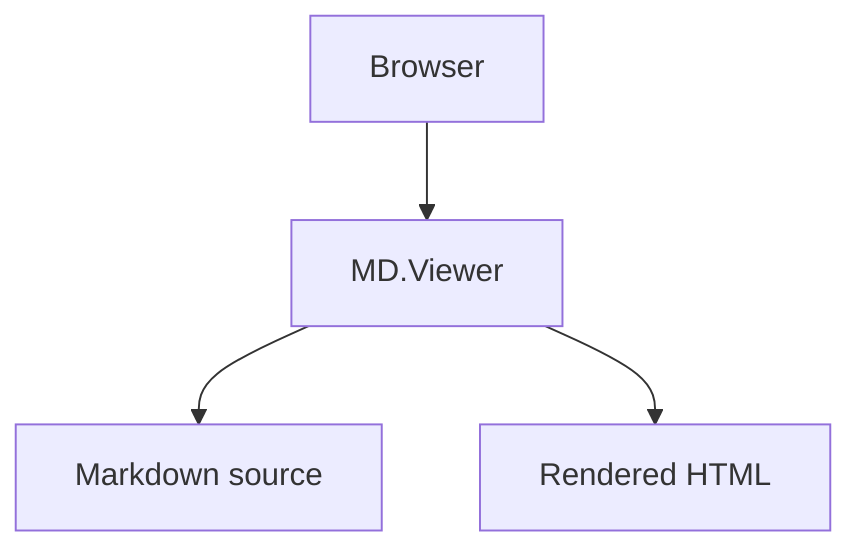

# MD.Viewer

> A secure, self-hosted PHP Markdown viewer that transforms plain `.md` files into polished, production-grade documentation pages — complete with auto-generated table of contents, heading numbering, footnotes, Mermaid diagrams, syntax-highlighted code blocks with one-click copy, dark mode, responsive layout controls, and a searchable file browser. No build step. No database. No dependencies beyond PHP itself.

[](https://github.com/paulmann/MD.Viewer/blob/main/LICENSE)
[](https://php.net)
[](https://github.com/paulmann/MD.Viewer/releases)

---

## Table of Contents

- [1. Quick Start](#1-quick-start)
- [2. Overview](#2-overview)
  - [2.1 The Problem](#21-the-problem)
  - [2.2 Who Is It For](#22-who-is-it-for)
  - [2.3 Use Cases](#23-use-cases)
- [3. Requirements](#3-requirements)
- [4. Installation](#4-installation)
  - [4.1 Via Git](#41-via-git)
  - [4.2 Manual Installation](#42-manual-installation)
  - [4.3 PHP Built-in Server (Development)](#43-php-built-in-server-development)
  - [4.4 Apache](#44-apache)
  - [4.5 Nginx](#45-nginx)
- [5. File Structure](#5-file-structure)
- [6. Usage](#6-usage)
  - [6.1 Viewer Mode](#61-viewer-mode)
  - [6.2 File Browser Mode](#62-file-browser-mode)
  - [6.3 URL Parameters](#63-url-parameters)
- [7. Features](#7-features)
  - [7.1 Auto-generated Table of Contents](#71-auto-generated-table-of-contents)
  - [7.2 Heading Numbering](#72-heading-numbering)
  - [7.3 Mermaid Diagrams](#73-mermaid-diagrams)
  - [7.4 Code Blocks with Copy Button](#74-code-blocks-with-copy-button)
  - [7.5 Tables](#75-tables)
  - [7.6 Footnotes and Source References](#76-footnotes-and-source-references)
  - [7.7 Task Lists](#77-task-lists)
  - [7.8 Emoji Shortcodes](#78-emoji-shortcodes)
  - [7.9 Images](#79-images)
  - [7.10 Dark Mode](#710-dark-mode)
  - [7.11 Adaptive Content Width](#711-adaptive-content-width)
  - [7.12 Universal Inline Patterns](#712-universal-inline-patterns)
- [8. Configuration](#8-configuration)
  - [8.1 Feature Toggles](#81-feature-toggles)
  - [8.2 Security Limits](#82-security-limits)
  - [8.3 Paragraph Break Style](#83-paragraph-break-style)
- [9. Security](#9-security)
- [10. Markdown Syntax Reference](#10-markdown-syntax-reference)
  - [10.1 Headings](#101-headings)
  - [10.2 Inline Formatting](#102-inline-formatting)
  - [10.3 Links and Images](#103-links-and-images)
  - [10.4 Lists](#104-lists)
  - [10.5 Blockquotes](#105-blockquotes)
  - [10.6 Horizontal Rules](#106-horizontal-rules)
  - [10.7 Source Reference Links](#107-source-reference-links)
  - [10.8 Footnotes](#108-footnotes)
  - [10.9 Reference-style Links](#109-reference-style-links)
- [11. File Browser](#11-file-browser)
- [12. Script-name-based File Mapping](#12-script-name-based-file-mapping)
- [13. Edge Cases and Troubleshooting](#13-edge-cases-and-troubleshooting)
  - [13.1 File Not Rendering](#131-file-not-rendering)
  - [13.2 Mermaid Diagram Not Rendering](#132-mermaid-diagram-not-rendering)
  - [13.3 Duplicate Heading Numbers](#133-duplicate-heading-numbers)
  - [13.4 File Browser Shows No Files](#134-file-browser-shows-no-files)
  - [13.5 TOC Not Shown on Short Documents](#135-toc-not-shown-on-short-documents)
  - [13.6 Character Encoding Issues](#136-character-encoding-issues)
  - [13.7 Offline Usage](#137-offline-usage)
- [14. Changelog](#14-changelog)
- [15. License](#15-license)

---

## 1. Quick Start

```bash
# Clone the repository into your web server's document root
git clone https://github.com/paulmann/MD.Viewer.git /var/www/html/docs

# Place your Markdown file alongside the script
echo "# Hello, World\n\nThis is my documentation." > /var/www/html/docs/index.md

# Open in your browser
# https://your-domain.com/docs/
```

> **Minimal setup:** drop `index.php` and `index.md` into the same directory and open `index.php` in a browser. MD.Viewer will automatically locate and render `index.md` — no configuration required.

---

## 2. Overview

### 2.1 The Problem

Markdown is the de facto standard for technical documentation. Developers author it, teams store it in repositories, and CI pipelines publish it. Yet the raw `.md` format is entirely unsuitable for end-user consumption: there is no navigation, no numbered sections, no visual hierarchy, and no way to render diagrams or highlight code without a full build pipeline.

Existing solutions force a choice between heavy infrastructure — Node.js-based static site generators with complex toolchains and npm dependency trees — or external SaaS platforms that introduce vendor lock-in and potential data privacy concerns.

**MD.Viewer collapses that complexity into a single PHP file.** Drop it next to any `.md` document and you instantly have a professional, self-hosted documentation page with zero external dependencies, no database, no build step, and no ongoing maintenance overhead.

### 2.2 Who Is It For

- Developers who need to publish internal or customer-facing technical documentation on their own infrastructure
- Engineering teams running internal wikis backed by Markdown files in a repository
- DevOps and SRE engineers who want a fast, distraction-free way to browse READMEs and runbooks
- Technical writers who author Markdown content and need an immediate, accurate preview
- Anyone who wants beautifully rendered `.md` files without the overhead of a full documentation framework

### 2.3 Use Cases

| Scenario | Description |
|---|---|
| Project documentation | Place `index.md` alongside the script — get a polished documentation page instantly |
| File browser | Open a directory with no `.md` file and get a sortable, searchable index of all Markdown files |
| Multi-page documentation | Navigate between files using the `?file=path/to/doc.md` query parameter |
| Internal wiki | Deploy the script and a set of `.md` files on a private server — no CMS required |
| Self-hosted blog | Each post is a `.md` file; a matching PHP file finds and renders it automatically |

---

## 3. Requirements

- **PHP** 8.0 or higher (8.2+ recommended)
- A web server: **Apache**, **Nginx**, or the **PHP built-in development server**
- PHP extension: `mbstring` (enabled by default in most distributions)
- Browser-side internet access for CDN assets: Tailwind CSS, Google Fonts, and Mermaid

> **Air-gapped or offline environments:** replace the CDN `<script>` and `<link>` tags in `index.php` with locally served copies of the respective libraries.

---

## 4. Installation

### 4.1 Via Git

```bash
git clone https://github.com/paulmann/MD.Viewer.git
cd MD.Viewer
```

### 4.2 Manual Installation

1. Download the latest release archive from [GitHub Releases](https://github.com/paulmann/MD.Viewer/releases).
2. Extract the archive into your web server's document root or a subdirectory thereof.
3. Verify that `index.php` is reachable via a browser.

### 4.3 PHP Built-in Server (Development)

```bash
cd /path/to/MD.Viewer
php -S localhost:8080
# Navigate to http://localhost:8080
```

### 4.4 Apache

No `.htaccess` configuration is required. Ensure that `mod_php` or `php-fpm` is active and that the target directory is readable by the web server process.

### 4.5 Nginx

```nginx
server {
    listen 80;
    server_name docs.example.com;
    root /var/www/html/docs;
    index index.php;

    location ~ \.php$ {
        include fastcgi_params;
        fastcgi_pass unix:/run/php/php8.2-fpm.sock;
        fastcgi_param SCRIPT_FILENAME $document_root$fastcgi_script_name;
    }
}
```

---

## 5. File Structure

```
MD.Viewer/
├── index.php              # Core rendering engine — the entire application
├── index.md               # Your default Markdown document
├── assets/
│   ├── css/
│   │   └── md.css      # Supplementary stylesheet
│   └── js/
│       └── md.js          # Client-side logic: theme switching, layout width,
│                          # copy-to-clipboard, Mermaid lazy initialization
├── LICENSE
└── README.md
```

> The script automatically resolves the companion Markdown file by matching its own filename: a script named `docs.php` looks for `docs.md`. This makes it straightforward to deploy multiple independent viewer instances within a single directory, each serving its own document.

---

## 6. Usage

### 6.1 Viewer Mode

When a matching `.md` file is found — either by name inference or via the `?file=` parameter — the script enters **viewer mode**:

- The page title is derived from the first `#` heading in the document.
- The meta description is extracted from the first paragraph.
- An auto-generated table of contents is rendered before the article body.
- The full Markdown source is parsed and emitted as structured, styled HTML.

### 6.2 File Browser Mode

When no `.md` file can be located, the script enters **file browser mode**:

- The current directory is scanned recursively up to `MAX_SCAN_DEPTH` levels.
- Results are displayed in a sortable table with columns: File, Dir, Created, Modified, Size.
- A debounced live search field filters rows in real time by filename or directory path.
- Clicking any row opens the corresponding file in a new tab via `?file=`.

### 6.3 URL Parameters

| Parameter | Description | Example |
|---|---|---|
| `?file=path/to/doc.md` | Render a specific Markdown file | `?file=docs/api.md` |

The path must be **relative** and must resolve to a file within the script's own directory tree. Absolute paths, path traversal sequences (`../`), null bytes, and control characters are all rejected outright by the validation layer.

---

## 7. Features

### 7.1 Auto-generated Table of Contents

MD.Viewer automatically collects all headings from level `##` through `######` and constructs a hierarchical table of contents that appears above the article body. The TOC:

- Renders the full heading hierarchy with proportional indentation
- Generates stable anchor slugs derived from each heading's text content
- Handles duplicate headings gracefully by appending `-2`, `-3`, etc.
- Can be disabled via the `AUTO_TOC` constant

```php
const AUTO_TOC = true; // Set to false to suppress the table of contents
```

### 7.2 Heading Numbering

All headings are automatically numbered in hierarchical dotted notation — `1.`, `1.1.`, `1.1.1.`, and so on. The engine intelligently detects manually numbered headings and skips auto-numbering for them, while preserving the counter state for subsequent headings.

```php
const AUTO_NUMBERING = true; // Set to false to disable automatic numbering
```

> **Edge case:** headings that already carry a manual prefix such as `1. Introduction`, `1.1 Background`, or `I. Preface` are automatically recognized as manually numbered. Auto-numbering is skipped for those specific headings, but the internal counter continues uninterrupted for any following un-prefixed headings.

### 7.3 Mermaid Diagrams

Fenced code blocks declared with the language identifier ` ```mermaid ` or ` ```mmd ` are rendered as interactive Mermaid diagrams.

````markdown

````

The Mermaid library is loaded **lazily** — it is fetched from CDN only when at least one diagram block is present in the document. Pages with no diagrams incur zero Mermaid-related overhead.

### 7.4 Code Blocks with Copy Button

Every fenced code block is rendered in a full editor-inspired style:

- A header bar with macOS-style traffic-light decorators and the detected language label
- A **Copy** button that writes the block's content to the system clipboard
- After a successful copy, the button transitions to a **Copied!** state with a green checkmark icon
- Syntax class names in the form `language-*` are applied for downstream highlighter compatibility

### 7.5 Tables

Standard GFM pipe tables are supported, including per-column alignment directives:

```markdown
| Left-aligned | Centered | Right-aligned |
|:-------------|:--------:|--------------:|
| Value        |  Value   |         Value |
```

All tables are wrapped in a horizontally scrollable container so they remain usable on narrow viewports.

### 7.6 Footnotes and Source References

**Source references** are a MD.Viewer-specific convention for numbered inline citations rendered as a formatted reference list at the end of the document:

```markdown
This claim is supported by prior research [1] and industry benchmarks [2].

[1]: Title of First Source - URL: https://example.com
[2]: Title of Second Source - URL: https://example.org
```

Inline citations are rendered as superscript numerals with hyperlinks. The reference section heading must be `## Sources List` or `## Sources` — it is automatically excluded from the body and rendered as a styled list at the bottom of the page.

**Footnotes** follow the standard `[^identifier]` convention:

```markdown
This statement requires a clarification.[^clarification]

[^clarification]: Here is the full explanatory note, with **inline formatting** support.
```

Requires `FEATURE_FOOTNOTES = true`.

### 7.7 Task Lists

```markdown
- [x] Completed item
- [ ] Pending item
```

Rendered as read-only checkboxes. Requires `FEATURE_TASK_LISTS = true`.

### 7.8 Emoji Shortcodes

Text shortcodes are substituted with their Unicode equivalents at render time:

```markdown
:check: All tests passing
:warning: Deprecated in v3
:rocket: Initial release
:bulb: Pro tip
```

Supported shortcodes: `:smile:`, `:laughing:`, `:joy:`, `:heart:`, `:thumbsup:`, `:thumbsdown:`, `:warning:`, `:error:`, `:check:`, `:x:`, `:star:`, `:fire:`, `:bulb:`, `:rocket:`, `:link:`, `:info:`.

Requires `FEATURE_EMOJI = true`.

### 7.9 Images

```markdown

```

- `loading="lazy"` and `decoding="async"` attributes are injected automatically for optimal performance.
- If an image fails to load, it is hidden and a text fallback is shown in its place.
- Requires `FEATURE_IMAGES = true`.

### 7.10 Dark Mode

A theme toggle button is available in the page header. The user's preference is persisted in `localStorage` and restored on subsequent visits. The active color scheme is applied via a `data-theme` attribute on the `<html>` element, which Tailwind's dark-mode variant uses as its selector.

### 7.11 Adaptive Content Width

In viewer mode, three content column widths are available from the header toolbar:

| Mode    | Width   | Best suited for |
|---------|---------|------------------|
| Reading | `72ch`  | Long prose and narrative documentation |
| Article | `90ch`  | Technical docs with inline code snippets |
| Wide    | `120ch` | Wide tables, diagrams, and side-by-side comparisons |

The selected width is persisted in `localStorage`.

### 7.12 Universal Inline Patterns

MD.Viewer supports a lightweight inline syntax for visualizing graph nodes, relationships, and annotated patterns directly within paragraph text — no separate diagram block required:

```markdown
`(Node A)--[relationship]->(Node B){annotation}`
```

Requires both `UNIVERSAL_PATTERNS = true` and `CYPHER_PATTERNS = true`.

---

## 8. Configuration

All configuration constants are declared near the top of `index.php` in the **Feature toggles** block. No separate configuration file is needed.

### 8.1 Feature Toggles

```php
const AUTO_NUMBERING        = true;  // Automatic hierarchical heading numbering
const AUTO_TOC              = true;  // Auto-generated table of contents
const AUTO_FOOTNOTES_LINKS  = true;  // Render source reference list at end of page
const DOUBLE_LINE_BREAKS    = true;  // Treat double line break as <br>
const CYPHER_PATTERNS       = true;  // Inline Cypher / graph pattern visualization
const UNIVERSAL_PATTERNS    = true;  // Inline universal pattern visualization
const FEATURE_IMAGES        = true;  // Render Markdown image syntax as 
const FEATURE_REF_LINKS     = true;  // Reference-style links: [label][ref]
const FEATURE_TASK_LISTS    = true;  // GFM task list checkboxes
const FEATURE_FOOTNOTES     = true;  // Footnote syntax: [^id]
const FEATURE_SUB_SUP       = true;  // Subscript ~text~ and superscript ^text^
const FEATURE_EMOJI         = true;  // Emoji shortcode substitution
```

### 8.2 Security Limits

```php
const MAX_FILE_PARAM_LENGTH = 255;   // Maximum allowed length of the ?file= parameter
const MAX_SCAN_DEPTH        = 3;     // Maximum directory recursion depth during scanning
const MAX_FILES_SCAN        = 10000; // Maximum number of files processed in a single scan
```

> **Recommendation:** on servers with large directory trees, reduce `MAX_SCAN_DEPTH` and `MAX_FILES_SCAN` to keep the file browser responsive. A depth of `1` is sufficient for most flat documentation layouts.

### 8.3 Paragraph Break Style

```php
const PARAGRAPH_BREAK_STYLE = 'double-br'; // Options: 'double-br', 'paragraph', 'space', 'nbsp'
```

| Value | Behavior |
|---|---|
| `double-br` | A double line break is emitted as `<br><br>` |
| `paragraph` | A double line break opens a new `<p>` element with margin |
| `space` | A double line break is collapsed to a single space |
| `nbsp` | A double line break is replaced with a non-breaking space |

---

## 9. Security

MD.Viewer applies a **14-layer defense-in-depth validation chain** to every value supplied via the `?file=` query parameter. Each layer is a hard gate — a failure at any point immediately aborts the request and returns an access-denied response.

1. **Length check** — the parameter value must not exceed `MAX_FILE_PARAM_LENGTH` characters.
2. **Null-byte rejection** — embedded `\0` characters are unconditionally blocked.
3. **Control character rejection** — ASCII codepoints 0–31, 127, and backspace are rejected.
4. **URL-decode and re-validate** — the value is decoded to catch encoded traversal sequences such as `%2e%2e%2f`, then all control-character checks are re-applied.
5. **Absolute path rejection** — Unix-style (`/`), Windows drive (`C:\`), and UNC (`\\`) prefixes are all disallowed.
6. **Path traversal normalization** — directory separators are normalized and any resulting `..` segments are rejected.
7. **Character whitelist** — only the characters `A-Za-z0-9`, `.`, `-`, `_`, and `/` are permitted in the final path.
8. **Directory depth cap** — the number of path segments must not exceed `MAX_SCAN_DEPTH`.
9. **Extension enforcement** — the file must carry a `.md` extension (case-insensitive).
10. **Base directory `realpath` resolution** — the canonical absolute path of the base directory is established.
11. **Target file `realpath` resolution** — the canonical absolute path of the requested file is established; the file must exist.
12. **Containment check** — the resolved file path must be strictly prefixed by the resolved base directory path.
13. **File type assertion** — the target must be a regular file; directories, device nodes, and other special files are rejected.
14. **Post-symlink extension re-check** — the extension is verified again on the real, symlink-resolved path to prevent extension-spoofing via symbolic links.

`POST` requests are silently ignored. The application processes `GET` exclusively.

---

## 10. Markdown Syntax Reference

### 10.1 Headings

```markdown
# Heading Level 1
## Heading Level 2
### Heading Level 3
#### Heading Level 4
##### Heading Level 5
###### Heading Level 6

# Setext-style headings are also supported:
Heading Level 1
===============
Heading Level 2
---------------
```

### 10.2 Inline Formatting

```markdown
**Bold text**
__Also bold__
*Italic text*
_Also italic_
~~Strikethrough~~
==Highlighted==
~Subscript~       (requires FEATURE_SUB_SUP)
^Superscript^     (requires FEATURE_SUB_SUP)
`inline code`
```

### 10.3 Links and Images

```markdown
[Link text](https://example.com)
[Link with title](https://example.com "Tooltip text")


```

### 10.4 Lists

```markdown
- Unordered list item
- Another item

1. Ordered list item
2. Another item

- [x] Completed task       (requires FEATURE_TASK_LISTS)
- [ ] Pending task         (requires FEATURE_TASK_LISTS)
```

### 10.5 Blockquotes

```markdown
> This is a blockquote.
> It can span multiple lines.
```

### 10.6 Horizontal Rules

```markdown
---
***
___
```

### 10.7 Source Reference Links

```markdown
This conclusion is drawn from field observations [1] and published benchmarks [2].

[1]: Name of First Source - URL: https://example.com
[2]: Name of Second Source - URL: https://example.org
```

> The section containing source definitions must carry a heading of `## Sources List` or `## Sources`. This heading and its content are automatically stripped from the rendered document body and re-emitted as a styled reference list at the foot of the page.

### 10.8 Footnotes

```markdown
This technique has important caveats.[^caveats]

[^caveats]: A full explanation of the caveats, with support for **inline formatting**.
```

### 10.9 Reference-style Links

```markdown
[Link text][ref-identifier]

[ref-identifier]: https://example.com "Optional title attribute"
```

---

## 11. File Browser

When MD.Viewer is opened in a directory that contains no matching `.md` file — either because none exists or because a `?file=` lookup failed — it activates the **file browser mode**:

- **Recursive scanning** traverses subdirectories up to `MAX_SCAN_DEPTH` levels deep.
- **Hidden file filtering** excludes any file or directory whose name begins with a `.`.
- **Sortable columns** allow ordering by File, Dir, Created, Modified, or Size with a single click.
- **Live search with debounce** filters the table in real time as the user types, matching against both the filename and the directory path.
- **Open in new tab** — clicking any row navigates to that file via `?file=`, opening it in a new browser tab.
- **Symlink escape protection** — symbolic links that resolve outside the base directory are silently skipped.

---

## 12. Script-name-based File Mapping

MD.Viewer supports a zero-configuration multi-page layout through automatic PHP-to-Markdown filename inference:

```
/docs/
├── index.php      → automatically serves index.md
├── api.php        → automatically serves api.md
├── changelog.php  → automatically serves changelog.md
├── index.md
├── api.md
└── changelog.md
```

Each PHP file is a fully independent documentation page that locates its companion `.md` document without any routing configuration. This pattern is particularly well-suited to small documentation sites where each top-level topic deserves a dedicated, bookmarkable URL.

---

## 13. Edge Cases and Troubleshooting

### 13.1 File Not Rendering

**Symptom:** the file browser or an error message is shown instead of the expected document.

**Checklist:**
- The `.md` file resides in the same directory as `index.php`.
- The Markdown filename matches the PHP script name exactly (`index.php` → `index.md`).
- The file carries a `.md` extension — the check is case-insensitive, but the extension must be present.
- File system read permissions are correctly set (`chmod 644` or equivalent).

### 13.2 Mermaid Diagram Not Rendering

**Symptom:** the diagram source is displayed as plain text inside a code block.

**Checklist:**
- The fenced block is annotated with ` ```mermaid ` or ` ```mmd `.
- The diagram syntax is valid — use [mermaid.live](https://mermaid.live) to verify.
- The browser can reach `cdn.jsdelivr.net`.

### 13.3 Duplicate Heading Numbers

**Symptom:** a heading written as `1. Introduction` renders as `1. 1. Introduction`.

**Cause:** `AUTO_NUMBERING` is enabled, but the engine's manual-numbering detector has not matched this particular heading format.

**Resolution:** MD.Viewer recognizes the following patterns as manually numbered and skips auto-numbering for them: `1. Text`, `1.1 Text`, `1.1.1 Text`, `I. Text`, `XIV. Text`. Bare integers without a following separator — e.g., `1 Introduction` — are not considered manual numbers and will receive an auto-generated prefix.

### 13.4 File Browser Shows No Files

**Symptom:** the file browser is empty or displays "No .md files found".

**Checklist:**
- `MAX_SCAN_DEPTH` is not set to `0`. At depth `0`, only the immediate directory is scanned — no subdirectories.
- The target files are not inside hidden directories (names beginning with `.`).
- The total file count does not exceed `MAX_FILES_SCAN`.
- Check the server's PHP error log for any `MD.Viewer scanMarkdownFiles` entries, which indicate scan failures.

### 13.5 TOC Not Shown on Short Documents

**Behavior:** the table of contents is intentionally suppressed when a document contains fewer than two headings. For single-section documents, a TOC would be redundant and visually noisy.

### 13.6 Character Encoding Issues

MD.Viewer operates exclusively in **UTF-8**. If rendered output contains garbled characters, verify the following:
- All `.md` source files are saved as UTF-8 **without BOM**.
- The web server includes `charset=UTF-8` in the `Content-Type` response header.

### 13.7 Offline Usage

By default, MD.Viewer loads the following assets from external CDNs at page render time:

- **Tailwind CSS** — `cdn.tailwindcss.com`
- **Google Fonts** — Inter and Sora typefaces
- **Mermaid** — `cdn.jsdelivr.net` (only when diagrams are present)

For air-gapped environments, replace these CDN references with locally hosted copies. Download each library, serve it from the `assets/` directory, and update the corresponding `<link>` and `<script>` tags in `index.php`.

---

## 14. Changelog

### v2.2.5

- **FIXED:** Badge and inline images rendered vertically instead of inline when multiple
  image-only lines appeared consecutively in a paragraph. The `$flushPara` closure now
  uses per-pair glue resolution: any line boundary where at least one neighbour contains
  an `` uses a plain space instead of the configured `<br><br>` separator, so badges
  flow horizontally without altering behaviour for plain-text paragraphs.
- **FIXED:** Setext headings (`===` / `---` underline syntax) were never rendered by
  `renderMarkdown`, causing heading-counter desynchronisation (`$si`) between
  `collectHeadings` and `renderMarkdown`. A dedicated setext branch with `array_pop($para)`
  was added, mirroring the logic already present in `collectHeadings`.
- **FIXED:** ATX heading regex in `renderMarkdown` was narrower than the one in
  `collectHeadings`, causing further `$si` drift for headings with leading spaces or
  trailing `#` markers. Both functions now share the same pattern:
  `/^ {0,3}(#{1,6})\s+(.*?)\s*#*\s*$/u`.
- **REFACTOR:** Heading render logic extracted into a `$renderHeading` closure, eliminating
  code duplication between the ATX and setext branches.
- **REFACTOR:** `$src`, `$refs`, and `$fn` are now captured **by reference** (`&`) in all
  inner closures of `renderMarkdown`, making data-flow explicit and preventing stale-copy
  bugs if these arrays were ever mutated mid-render.

### v2.2.4

- **FIXED:** `TypeError: slugify(): Argument #1 must be of type string, int given` thrown
  by `renderFootnotes` when footnote identifiers are numeric (e.g. `[^1]`). `slugify` now
  accepts `string|int`; all call-sites that receive raw array keys cast them explicitly to
  `string`.
- **FIXED:** `[](url)` syntax corrupted — the `` tag was HTML-escaped
  and then re-wrapped in a spurious `<a>` by the link handler. Images are now extracted
  into raw-HTML placeholders **before** `htmlspecialchars` runs, so the generated markup
  is never escaped and link patterns cannot match it.

### v2.2.3

- **FIXED:** Robust numeric and Roman-numeral prefix detection in `hasManualNumbering`.
  Corrects false negatives for short titles such as `5 A`, rejects year/ID/tech-label
  tokens, and validates canonical Roman numerals to prevent plain words (`Civic`, `Mix`)
  from being treated as numbering.
- **FIXED:** Undefined `$lvl`, `$txt`, and `$slug` variables and a `TypeError` in
  `hasManualNumbering` inside `collectHeadings`. Parser state is now initialised before
  the loop; every heading entry carries a `manual_number` flag.
- **IMPROVED:** GitHub-compatible anchor slugging in `slugify` — strips HTML tags,
  lowercases with Unicode awareness, removes non-letter/digit/hyphen characters, and
  replaces whitespace with hyphens, matching GitHub's own algorithm for `#anchor` links.
- **IMPROVED:** Unicode-aware key normalisation in `parseReferenceLinks`; supports both
  `"double"` and `'single'` quoted titles; first definition wins on duplicate keys.
- **IMPROVED:** Hardened EOL-anchored terminator lookahead in `parseFootnotes`; duplicate
  identifier guard added; multi-line bodies are whitespace-collapsed; identifiers always
  stored as `string` to prevent downstream `TypeError`.

### v2.2.2

- **FIXED:** Duplicate numbering in headings that already carry a manual prefix
  (e.g., `1. Title`). A manual-numbering detector was added that skips auto-numbering
  for such headings.
- **FIXED:** The heading counter no longer increments for manually-numbered headings,
  preserving the correct sequence for subsequent auto-numbered headings.
- **FIXED:** The TOC respects the manual-numbering flag — no duplicate prefixes appear
  in navigation links.

### v2.2.1

- **FIXED:** "No .md files found" regression caused by `RecursiveDirectoryIterator` not
  exposing a `getDepth()` method. Replaced `RecursiveCallbackFilterIterator` with manual
  depth checks via `RecursiveIteratorIterator`.
- **FIXED:** Silent exception swallowing — errors are now surfaced via `error_log` for
  diagnostics.
- **SECURITY:** Added symlink escape protection in the file scanner.
- **IMPROVED:** Hidden file filtering now covers files nested inside hidden directories
  (e.g., `.hidden/sub.md`).

### v2.2.0

- **SECURITY:** 8-layer path traversal protection for the `?file=` parameter.
- **SECURITY:** Null-byte, control-character, and URL-encoded attack vectors rejected.
- **SECURITY:** `realpath`-based whitelist validation against the base directory.
- **SECURITY:** Symlink resolution protection.
- **FEATURE:** File browser table displayed when no matching `.md` file is found.
- **FEATURE:** Sortable columns — File, Dir, Created, Modified, Size.
- **FEATURE:** Instant search with debounce.
- **FEATURE:** Click-to-open in new tab via GET parameter.
- **REFACTOR:** All JavaScript extracted to `assets/js/md.js`.

### v2.1.0

- **FEATURE:** Dynamic Markdown file loading inferred from the PHP script filename.
- **FEATURE:** Professional copy-to-clipboard buttons for fenced code blocks.
- **IMPROVED:** Editor-style code block UI with traffic-light header decoration.

---

## 15. License

Distributed under the [MIT License](https://github.com/paulmann/MD.Viewer/blob/main/LICENSE).

```
Copyright (c) 2026 Mikhail Deynekin
https://github.com/paulmann/MD.Viewer
```

You are free to use, copy, modify, merge, publish, distribute, sublicense, and sell copies of this software, subject to the condition that the above copyright notice and this permission notice are included in all copies or substantial portions of the software.

---

<div align="center">

Crafted with care by [Mikhail Deynekin](https://Deynekin.com) &nbsp;&middot;&nbsp; [Deynekin.com](https://Deynekin.com)

</div>
